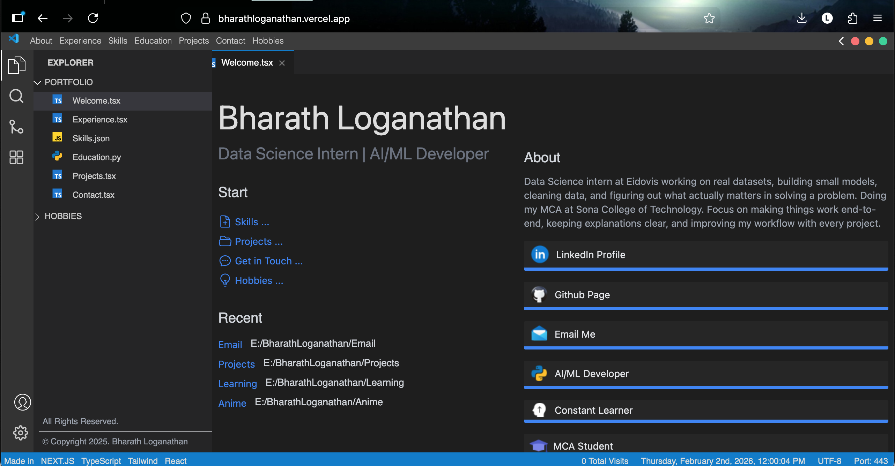

# Portfolio - VS Code Theme

A personal portfolio website designed to look and feel like Visual Studio Code. Built with Next.js and styled with Tailwind CSS.



## Live Demo

[bharathloganathan.vercel.app](https://bharathloganathan.vercel.app)

## Features

- **VS Code-inspired UI** - File explorer sidebar, tabs, and editor layout
- **Responsive Design** - Works on desktop and mobile devices
- **Multiple Sections** - Skills, Projects, Experience, Education, Hobbies, and more
- **Contact Form** - Email functionality powered by Resend
- **Analytics** - Integrated with Vercel Analytics
- **Progress Bar** - Smooth page transitions with loading indicator

## Tech Stack

### Frontend
- **[Next.js 13](https://nextjs.org/)** - React framework with file-based routing
- **[React 18](https://react.dev/)** - UI library
- **[TypeScript](https://www.typescriptlang.org/)** - Type safety
- **[Tailwind CSS](https://tailwindcss.com/)** - Utility-first CSS framework

### Libraries & Tools
- **[Resend](https://resend.com/)** - Email API for contact form
- **[Zod](https://zod.dev/)** - Schema validation
- **[Moment.js](https://momentjs.com/)** - Date/time handling
- **[Sharp](https://sharp.pixelplumbing.com/)** - Image optimization
- **[react-medium-image-zoom](https://github.com/rpearce/react-medium-image-zoom)** - Image zoom functionality
- **[react-vertical-timeline-component](https://github.com/stephane-monnot/react-vertical-timeline)** - Timeline for experience/education
- **[nextjs-progressbar](https://github.com/apal21/nextjs-progressbar)** - Page loading indicator

### Deployment & Analytics
- **[Vercel](https://vercel.com/)** - Hosting and deployment
- **[@vercel/analytics](https://vercel.com/analytics)** - Website analytics

## Project Structure

```
├── Components/
│   ├── Helper/
│   │   ├── useIsMobile.ts       # Responsive hook for mobile detection
│   │   └── utility.ts           # Utility functions
│   ├── Layouts/
│   │   ├── Layout.tsx           # Main layout wrapper
│   │   ├── SeondPanel/          # Secondary sidebar panel
│   │   │   ├── SidePanelSubLink.tsx
│   │   │   └── SideSecondPanel.tsx
│   │   └── SideMainPanel/
│   │       └── SideMainPanel.tsx  # Main VS Code-style sidebar
│   ├── SEO/
│   │   └── MetaTags.tsx         # SEO meta tags component
│   ├── SVG/
│   │   └── IconsSVG.tsx         # Custom SVG icons
│   ├── AnimeComponent.tsx       # Anime section component
│   ├── CustomScrollbar.tsx      # Custom scrollbar wrapper
│   └── ProjectDetails.tsx       # Project detail view
├── data/
│   ├── animedata.ts             # Anime list data
│   ├── BlogsData.ts             # Blog posts data
│   └── projectsdata.ts          # Projects portfolio data
├── lib/
│   ├── csrf.ts                  # CSRF protection
│   ├── rateLimiter.ts           # API rate limiting
│   └── validation.ts            # Zod validation schemas
├── pages/
│   ├── api/
│   │   ├── sendEmail.ts         # Contact form API (Resend)
│   │   └── sendEmailAWS.ts      # Contact form API (AWS SES)
│   ├── Projects/
│   │   ├── index.tsx            # Projects listing page
│   │   └── [projectname].tsx    # Dynamic project detail page
│   ├── _app.tsx                 # Next.js app wrapper
│   ├── index.tsx                # Home page
│   ├── Skills.tsx               # Skills & tech stack
│   ├── Experience.tsx           # Work experience timeline
│   ├── Education.tsx            # Education history
│   ├── Email.tsx                # Contact form
│   ├── Hobbies.tsx              # Hobbies section
│   ├── Gaming.tsx               # Gaming hobby page
│   ├── Anime.tsx                # Anime hobby page
│   ├── Blogs.tsx                # Blog posts
│   ├── Learning.tsx             # Learning journey
│   ├── Startup.tsx              # Startup experience
│   └── 404.tsx                  # Custom 404 page
├── public/                      # Static assets (images, audio)
├── styles/                      # Global CSS styles
├── types/
│   └── index.ts                 # TypeScript type definitions
├── tailwind.config.js           # Tailwind CSS configuration
├── tsconfig.json                # TypeScript configuration
└── vercel.json                  # Vercel deployment config
```

## Getting Started

### Prerequisites

- Node.js 16+
- npm or yarn

### Installation

1. Clone the repository
   ```bash
   git clone https://github.com/bharathlogs/Portfolio-vscode-theme.git
   cd Portfolio-vscode-theme
   ```

2. Install dependencies
   ```bash
   npm install
   ```

3. Set up environment variables
   ```bash
   cp .env.example .env.local
   ```

   Configure the following variables:
   - `RESEND_API_KEY` - Your Resend API key for the contact form

4. Run the development server
   ```bash
   npm run dev
   ```

5. Open [http://localhost:3000](http://localhost:3000) in your browser

## Scripts

| Command | Description |
|---------|-------------|
| `npm run dev` | Start development server |
| `npm run build` | Build for production |
| `npm run start` | Start production server |
| `npm run lint` | Run ESLint |

## Customization

1. **Personal Info** - Update `pages/index.tsx` with your name, title, and bio
2. **Projects** - Edit `data/projectsdata.ts` to add your projects
3. **Experience** - Modify the experience page with your work history
4. **Skills** - Update the skills page with your tech stack
5. **Styling** - Customize colors in `tailwind.config.js` and `styles/globals.css`

## License

This project is open source and available under the [MIT License](LICENSE.md).

## Author

**Bharath Loganathan**
- Website: [bharathloganathan.vercel.app](https://bharathloganathan.vercel.app)
- GitHub: [@bharathlogs](https://github.com/bharathlogs)
- LinkedIn: [Bharath Loganathan](https://www.linkedin.com/in/bharath-loganathan-100666253)
